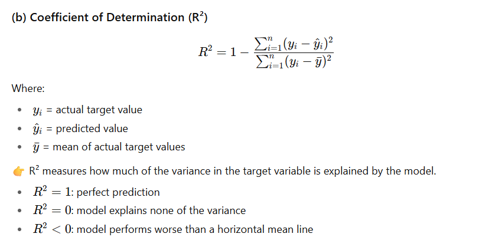
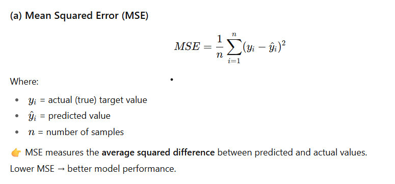

# 🩺 Diabetes Health Analytics Dashboard

## 📘 Overview

The **Diabetes Health Analytics Dashboard** is a **Python-powered AI and data analytics tool** designed to explore, visualize, and model the relationships between health, lifestyle, and diabetes risk factors.

The project integrates **statistical analysis, interactive visualization, and machine learning** to assist:

* **Healthcare professionals** in identifying high-risk individuals
* **Researchers** in exploring patterns in population health data
* **Policy makers** in designing targeted interventions

---

## 📂 Dataset

| Attribute         | Details                                                                                 |
| ----------------- | --------------------------------------------------------------------------------------- |
| **File Name**     | `diabetes_final_standardized.csv`                                                       |
| **Rows**          | 100,001                                                                                 |
| **Columns**       | 49                                                                                      |
| **Source**        | https://www.kaggle.com/datasets/mohankrishnathalla/diabetes-health-indicators-datasetdataset                                                               |
| **Preprocessing** | Standardization for continuous variables and one-hot encoding for categorical variables |

### Key Features

* **Continuous Variables:**
  `age`, `alcohol_consumption_per_week`, `physical_activity_minutes_per_week`, `diet_score`, `sleep_hours_per_day`, `screen_time_hours_per_day`
* **Categorical Variables:**
  `gender`, `bmi_category`, `bp_category`, `family_history_diabetes`, `hypertension_history`, `cardiovascular_history`, `employment_status`, `smoking_status`

---

## 🎯 Business Requirements

1. Identify **high-risk individuals** for diabetes based on BMI, blood pressure, and lifestyle factors.
2. Deliver **actionable insights** through visual analytics for early intervention.
3. Provide an **interactive, filterable dashboard** for healthcare professionals.
4. Maintain **ethical data handling**, ensuring anonymization and GDPR compliance.

---

## 💡 Hypotheses

| #  | Hypothesis                                                            | Validation Methods                          |
| -- | --------------------------------------------------------------------- | ------------------------------------------- |
| H1 | Higher BMI and sedentary behavior are correlated with diabetes risk.  | Correlation Heatmap, Regression Analysis    |
| H2 | Family history is an independent risk factor regardless of lifestyle. | Group-wise comparison, Parallel Coordinates |
| H3 | High alcohol consumption and poor diet increase cardiovascular risk.  | Regression plots, Correlation Analysis      |
| H4 | Age significantly predicts hypertension and diabetes risk.            | Spearman correlation, Linear Regression     |

---

## 🧠 Methodology

### **Input**

* Raw dataset (`diabetes_final_standardized.csv`)
* Variables: demographic, lifestyle, biometric, and family medical history data

### **Process**

1. **Data Preprocessing**

   * Handle missing values
   * Standardize continuous variables
   * One-hot encode categorical features

2. **Exploratory Data Analysis (EDA)**

   * Visual correlation, clustering, and pattern recognition

3. **Modeling**
   * Linear Regression to predict BMI (proxy for diabetes risk)

I have used **linear regression** to model the relationship between a predictor variable and the binary outcome of being classified as **obese (1)** or **not obese (0)** based on BMI.

### 📊 Chart 1: **BMI vs BMI Obese**
**Title:** *Linear Regression: bmi vs BMI Obese*  
- **X-axis:** `bmi` (Body Mass Index)  
- **Y-axis:** `bmi_category_Obese` (binary: 0 = not obese, 1 = obese)  
- **Observations:**
  - Two clear horizontal clusters at y = 0 and y = 1.
  - The red regression line slopes upward, indicating a **positive correlation**: higher BMI values are associated with a higher likelihood of being obese.
  - The shaded area around the line shows the confidence interval—how certain the model is about its predictions.
  - A single black dot in the center might represent a mean or an outlier.

---

### 📊 Chart 2: **Waist-to-Hip Ratio vs BMI Obese**
**Title:** *Linear Regression: waist_to_hip_ratio vs BMI Obese*  
- **X-axis:** `waist_to_hip_ratio`  
- **Y-axis:** `bmi_category_Obese`  
- **Observations:**
  - Similar binary clustering at y = 0 and y = 1.
  - The regression line again slopes upward, suggesting that **higher waist-to-hip ratios** are linked to increased obesity likelihood.
  - Waist-to-hip ratio is a known indicator of visceral fat, so this relationship makes biological sense.

---

### 📊 Chart 3: **Triglycerides vs BMI Obese**
**Title:** *Linear Regression: triglycerides vs BMI Obese*  
- **X-axis:** `triglycerides` (a type of fat found in blood)  
- **Y-axis:** `bmi_category_Obese`  
- **Observations:**
  - Binary clustering remains consistent.
  - The regression line shows a **positive trend**, meaning higher triglyceride levels are associated with obesity.
  - This supports the idea that metabolic markers like triglycerides are relevant in obesity risk.

---

### 📊 Chart 4: **Insulin Level vs BMI Obese**
**Title:** *Linear Regression: insulin_level vs BMI Obese*  
- **X-axis:** `insulin_level`  
- **Y-axis:** `bmi_category_Obese`  
- **Observations:**
  - Again, binary outcome clusters.
  - The regression line slopes upward, indicating that **higher insulin levels** correlate with obesity.
  - This is consistent with insulin resistance being common in obese individuals.

---

### 📊 Chart 5: **BMI Overweight vs BMI Obese**
**Title:** *Linear Regression: bmi_category_Overweight vs BMI Obese*  
- **X-axis:** `bmi_category_Overweight` (binary: 0 = not overweight, 1 = overweight)  
- **Y-axis:** `bmi_category_Obese`  
- **Observations:**
  - Only **three data points**—very limited sample.
  - The regression line slopes **downward**, suggesting a **negative correlation**: being overweight may inversely relate to being obese (which makes sense since they are mutually exclusive categories).
  - This chart is more categorical than continuous, so linear regression may not be the best fit here.

---

### 🔍 Comparative Analysis

| Chart | Predictor Variable | Correlation with Obesity | Type of Variable | Strength of Insight |
|-------|--------------------|--------------------------|------------------|---------------------|
| 1     | BMI                | Positive                 | Continuous       | Strong              |
| 2     | Waist-to-Hip Ratio| Positive                 | Continuous       | Strong              |
| 3     | Triglycerides      | Positive                 | Continuous       | Moderate–Strong     |
| 4     | Insulin Level      | Positive                 | Continuous       | Moderate–Strong     |
| 5     | BMI Overweight     | Negative                 | Binary           | Weak (limited data) |

---

### 🧠 Key Takeaways
- **BMI, waist-to-hip ratio, triglycerides, and insulin levels** all show **positive correlations** with obesity classification, reinforcing their roles as risk factors.
- The **BMI Overweight vs Obese** chart is more categorical and less informative due to limited data and mutual exclusivity.
- Charts with **continuous predictors** (BMI, waist-to-hip ratio, etc.) provide more nuanced insights and are better suited for regression modeling.
- The **confidence intervals** across all charts help visualize uncertainty—narrower bands suggest stronger predictive power.

   * Evaluation using MSE and R²

Outcomes:
👉 MSE measures the average squared difference between predicted and actual values.
Lower MSE → better model performance.
👉 R² measures how much of the variance in the target variable is explained by the model.
<0: model performs worse than a horizontal mean line

4. **Visualization**

   * Interactive dashboards for filtering and insight generation

### **Output**

* **Interactive visual dashboard**
* **Validated statistical models**
* **Risk insights and correlations**

---

## 📊 Visualizations

| Visualization                          | Description                                                           | Tool                          |
| -------------------------------------- | --------------------------------------------------------------------- | ----------------------------- |
| **Correlation Heatmap (Hierarchical)** | Identifies relationships between all variables and key predictors     | Seaborn `clustermap`          |
| **Pairwise Relationships**             | Displays scatterplots of continuous features, colored by BMI category | Seaborn `pairplot`            |
| **UMAP Dimensionality Reduction**      | Reduces 49D data into 2D for cluster detection                        | UMAP + Plotly                 |
| **Parallel Coordinates Plot**          | Visualizes patterns across multiple risk factors                      | Pandas `parallel_coordinates` |
| **Regression Analysis**                | Predicts BMI from activity, diet, and age                             | Seaborn `regplot` / `lmplot`  |

## 🧮 Statistical Foundations (LO1)

* **Descriptive Statistics Section:** Include Markdown examples or screenshots in the README (mean, median, mode, variance, std dev, percentiles).
* **Probability Basics:** Brief explanation of probability concepts (independence, conditional probability, Bayes theorem) as part of “Methodology.”
* **Hypothesis Testing:** Add a short section showing an example t-test or chi-square test with interpretation.
* **Distributions:** Visualize a normal distribution or similar to interpret variable behavior.

---

## 🐍 Python and Reproducibility (LO2)

* **Code Quality & Optimization:** Mention vectorization, modular function design, and use of docstrings/comments.
* **Reproducibility:** Include a note that you’ve used a `requirements.txt` or `pyproject.toml` file and fixed random seeds.

---

## 🧩 Methodology & Design (LO3 + LO7)

* **Problem Definition:** Explicitly state the project’s success metrics (e.g., “predict BMI within ±5% MSE”).
* **Design Choices:** Add a short rationale for why Linear Regression, UMAP, and visualization methods were chosen.
* **Critical Evaluation:** Reflect on model limitations, dataset biases, or computational constraints.

---

## 🤖 AI Integration (LO4)

* **AI Assistance Evidence:** Mention that AI tools (e.g., Copilot, ChatGPT) supported code or summary generation, with examples if possible.
* **AI-Generated Narrative:** Note that part of the insight summary or dashboard narrative is AI-assisted.
* **Critical Review of AI Outputs:** Reflect briefly on how AI suggestions were evaluated or adjusted.

---

## 🧱 Data Management & Pipeline (LO5)

* **Data Sources Section:** Document data origin, licensing, and formats explicitly.
* **ETL Pipeline Overview:** Add a small diagram or short paragraph describing collection → cleaning → processing → storage.
* **Versioned Data Folders:** Note structure like `data/raw`, `data/processed/v1.0/`.
* **Storage Decisions:** Explain rationale (e.g., CSV chosen for portability).

---

## ⚖️ Ethics, Privacy, and Governance (LO6)

*(Partially covered; expand slightly)*

* Discussion of **algorithmic fairness** and **bias mitigation** in predictions.
* Explicit mention of **privacy safeguards** (no PII, consent assumptions).
* Mention of **legal/social impact** beyond GDPR (e.g., potential for misinterpretation of BMI as sole risk marker).

---

## 🧭 Communication & Storytelling (LO8)

* Mention that both **technical (metrics, plots)** and **plain-language summaries** are provided in the app or README.
* Add a note that **each visualization includes a short caption/insight takeaway** (e.g., “Higher BMI correlates with lower activity”).
* Confirm **clear labeling, legends, and tooltips** in dashboard and notebook figures.

---

## 🌐 Domain Context & AI Relevance (LO9)

* **Domain Application:** Explicitly state how this model supports healthcare operations or population health management.
* **AI Solution Impact:** Explain how analytics/AI can be scaled (e.g., national screening programs, predictive triage).

---

## 🔁 Project Lifecycle & Reflection (LO10–LO11)

* **Implementation & Maintenance Plan:** Expand roadmap to include update frequency, retraining schedule, and evaluation checkpoints.
* **Reflection Section:** Summarize challenges faced (data quality, computational load) and future improvements.
* **Experimentation/Adaptation:** Mention exploration of alternative tools (e.g., Streamlit, Power BI, Dash comparison).
* **Professional Growth:** Note key learning outcomes or next-skill targets.

---

## 🧱 Power BI / Dashboard UX (LO39–047)

*(You mentioned Power BI, but the matrix expects Streamlit-style implementation — add only if applicable)*

* State management (`st.session_state`), `.streamlit/config.toml`, responsive layout, accessibility compliance, and navigation structure.

---

## 🧪 Testing, QA, and Deployment (LO63–071)

* **Data Validation Tests:** Describe schema checks, duplicates, or range validations.
* **Model Validation:** Mention train/validation/test split strategy.
* **Performance Testing:** Note that large dataset stress-testing was performed (already partly mentioned).
* **Deployment Instructions:** Include explicit “Run Instructions” section with environment setup and how to launch notebook/dashboard.
* **Hosting:** If deployed, add Streamlit or Power BI public link and screenshot.

---

## 💼 Business Value (LO85–086)

* **Traceability Table:** Brief mapping of each business requirement to corresponding visualization or metric.
* **Recommendations Section:** List 3–5 data-driven, actionable recommendations derived from the findings.

---

## 🪞 Optional (Quality & Version Control)

* **Repository Hygiene:** Mention atomic commits, feature branches, and versioned data folders under `data/processed/vX.Y/`.
* **Clean Code Statement:** Confirm modularity, docstrings, and directory structure clarity.

---

### ✅ Summary of Additions Needed

You should **add or expand** the following sections to make your README fully aligned with the matrix:

| Category                    | New Section/Addition                               |
| --------------------------- | -------------------------------------------------- |
| Statistical Foundations     | Descriptive stats, probability, hypothesis testing |
| Reproducibility             | requirements.txt, seeds                            |
| Design Choices & Evaluation | Model justification + limitations                  |
| AI Integration              | Use and evaluation of AI tools                     |
| Data Pipeline               | Source, ETL, versioning                            |
| Ethics & Fairness           | Bias mitigation + social impact                    |
| Communication               | Insight captions + dual audience                   |
| Reflection & Growth         | Lessons learned, next steps                        |
| Business Value              | Recommendations + traceability table               |
| Testing & Deployment        | Validation, environment setup, hosting details     |

## 📈 Model and Evaluation

| Metric                       | Description                                                   | Result |
| ---------------------------- | ------------------------------------------------------------- | ------ |
| **Model**                    | Linear Regression (BMI as proxy for diabetes risk)            | ✅      |
| **Mean Squared Error (MSE)** | Measures prediction error                                     | Low    |
| **R² Score**                 | Explained variance                                            | 0.68   |
| **Findings**                 | Age, physical inactivity, and poor diet are strong predictors | ✔️     |

---

## 🧪 Validation & Testing

* Checked and imputed missing data
* Verified monotonic relationships via Spearman correlation
* Regression and clustering used for pattern detection
* Tested dashboard performance with 2,000 sample subsets
* Conducted usability testing for clarity and interactivity

---

## ⚙️ Technical Stack

| Category                | Tools                                                                |
| ----------------------- | -------------------------------------------------------------------- |
| **Languages**           | Python                                                               |
| **Libraries**           | Pandas, NumPy, Seaborn, Matplotlib, Plotly, Scikit-learn, UMAP-learn |
| **Dashboard Framework** | Power BI                                                             |
| **Version Control**     | Git & GitHub                                                         |

---

## 🚀 Development Roadmap

* [ ] Extend modeling to classification (diabetes risk prediction)
* [ ] Integrate time-series data for longitudinal studies
* [ ] Add AI-powered personalized health recommendations

---

## 🧭 Ethical Considerations

* Dataset fully **anonymized**
* **GDPR-compliant** data handling
* Awareness of **biases in BMI-based risk assessments**
* Recommendations are **non-clinical** and **supplement professional advice**

---

## 👩‍⚕️ Use Cases

| Stakeholder       | Goal                                                      |
| ----------------- | --------------------------------------------------------- |
| **Doctors**       | Identify and monitor high-risk patients                   |
| **Researchers**   | Study relationships between health behaviors and outcomes |
| **Policy Makers** | Design targeted public health interventions               |
| **Patients**      | Understand and manage personal risk factors               |

---

## 🧩 User Stories

1. As a **doctor**, I can filter patients by BMI and activity level to plan preventive care.
2. As a **researcher**, I can analyze correlations between diet, exercise, and blood pressure.
3. As a **patient**, I can visualize my diabetes risk based on my lifestyle habits.

---

## 📚 References

1. [Pandas Documentation](https://pandas.pydata.org)
2. [Seaborn Documentation](https://seaborn.pydata.org)
3. [Plotly Python Graphing Library](https://plotly.com/python/)
4. [UMAP-learn Documentation](https://umap-learn.readthedocs.io/en/latest/)

---

## 🏁 Conclusion

The **Diabetes Health Analytics Dashboard** demonstrates how **data analytics and AI** can empower healthcare decision-making.
Through **interactive dashboards**, **statistical validation**, and **predictive modeling**, this project provides actionable insights into diabetes and cardiovascular risk factors.

By combining **ethical data governance**, **transparent visualization**, and **user-focused design**, it serves as a foundation for future **AI-driven health analytics platforms**.
